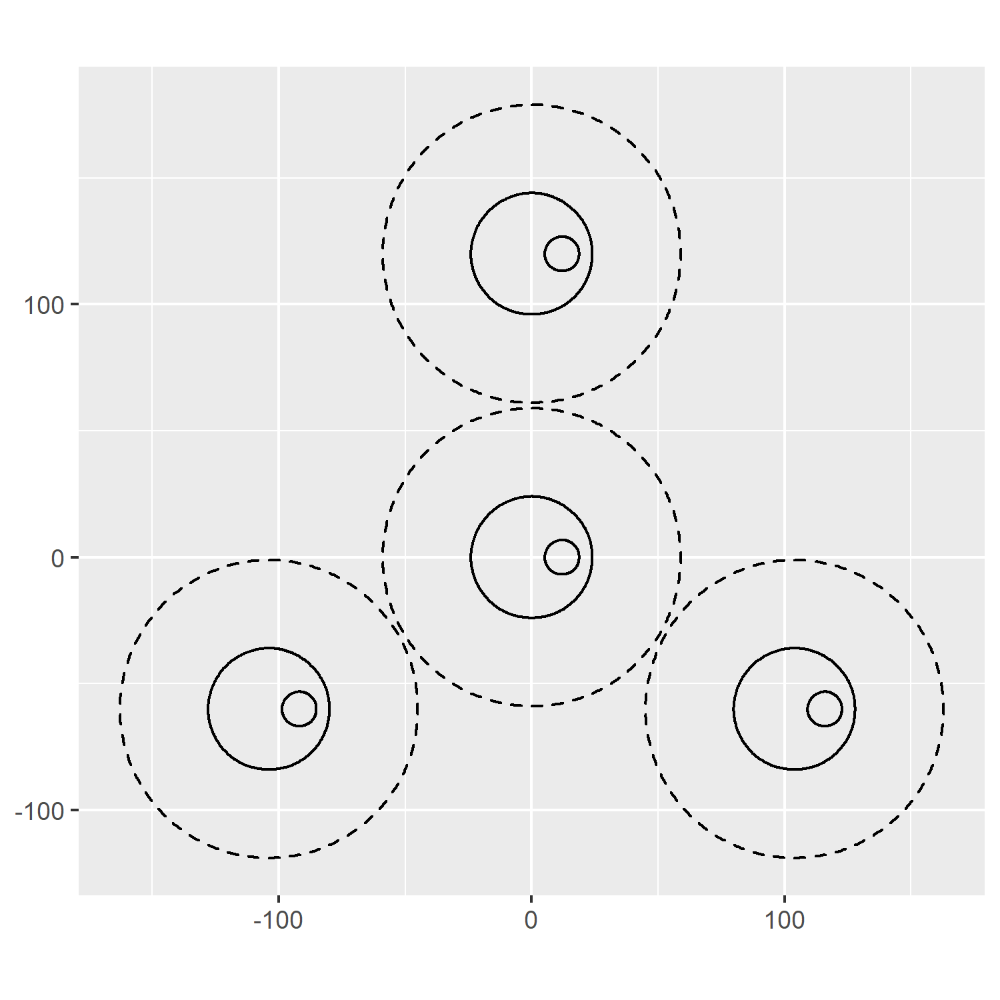
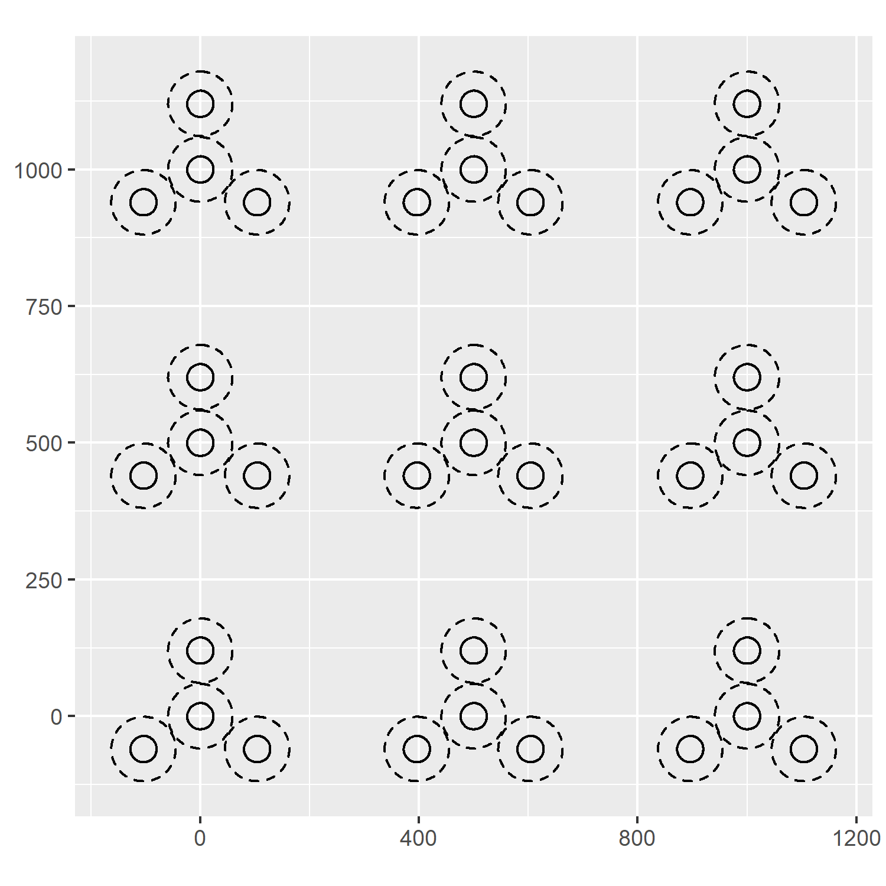

# ggfia

`ggfia` provides several `ggplot2` geoms that can be used to rapidly
compose FIA plot diagrams, which can be used for presentations,
documentation and other purposes. Users are free to add other `ggplot2`
geoms on top of `ggfia` geoms to create expressive and useful FIA plot
diagrams.

In general, users need only define the coordinates of the plot centers,
given in a dataframe as `x0` and `y0` columns. Future geoms will allow
users to independently position subplots.

To install:

``` r
devtools::install_github("brycefrank/ggfia")
```

- Compose an FIA plot resembling the Bechtold and Patterson (2005)
  diagram

``` r
library(ggfia)
library(ggplot2)

plot_coord <- data.frame(
  x0 = 0, y0 = 0
)

ggplot(plot_coord, aes(x0 = x0, y0 = y0)) +
  geom_macroplot(linetype = "dashed") +
  geom_midplot() +
  geom_microplot() +
  coord_equal()
```

<!-- -->

- Display only the midplot

Note that we use the term “midplot” to avoid conflating with “subplot”,
which refers to a relative plot position index.

``` r
ggplot(plot_coord, aes(x0 = x0, y0 = y0)) +
  geom_midplot() +
  coord_equal()
```

<!-- -->

- Display multiple plot diagrams

``` r
multi_plot_coords <- expand.grid(
  x0 = seq(0, 1000, by = 500),
  y0 = seq(0, 1000, by = 500)
)

ggplot(multi_plot_coords, aes(x0 = x0, y0 = y0)) +
  geom_macroplot(linetype = "dashed") +
  geom_midplot() +
  coord_equal()
```

<!-- -->

- Apply colors and facets

``` r
multi_plot_coords$my_group <- factor(1:9)

ggplot(multi_plot_coords) +
  geom_macroplot(aes(x0 = x0, y0 = y0, color = my_group), fill = "gray") +
  facet_wrap(~my_group) +
  coord_equal()
```

<!-- -->

- Display other geoms over the plot

``` r
pts <- data.frame(x = runif(10, -20, 20), y = runif(10, -20, 20))

ggplot() +
  geom_midplot(aes(x0 = x0, y0 = y0), data = plot_coord) +
  geom_point(aes(x = x, y = y), data = pts) +
  coord_equal()
```

<!-- -->
